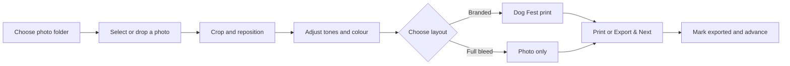

<div align="center">
  

  <h1>Collaroid Studio</h1>

  <p><strong>A fast, native macOS photo-to-print workflow for Collaroid Dog Fest.</strong></p>
  <p>Open a folder, perfect each portrait, and produce consistent event-ready prints—without uploading a single photo.</p>

  <p>
    
    
    
    
    
  </p>
</div>

---

## The studio, without the production drag

Collaroid Studio is a purpose-built desktop application for preparing **100 × 148 mm** Dog Fest photo prints. It combines a watched photo folder, a focused editor, precise print rendering, and an **Export & Next** workflow in one native Mac experience.

It is designed for busy event environments: predictable output, quick keyboard navigation, no browser tabs, no cloud dependency, and no accidental edits to original photographs.

## Highlights

| | Feature | What it does |
|---:|---|---|
| 📂 | **Live photo folder** | Watches a chosen folder for JPG, JPEG, and PNG files and refreshes the browser as new photos arrive. |
| 🖼️ | **Flexible browser** | Shows thumbnails vertically on the left or horizontally below the canvas, with exported-photo checkmarks. |
| ✨ | **Native Mac interface** | Uses SwiftUI, AppKit, SF Symbols, system materials, inspectors, toolbars, keyboard commands, and Liquid Glass where available. |
| 🔍 | **Direct crop control** | Zoom with a mouse wheel or trackpad pinch, then drag the photograph into position. |
| 🎨 | **Photographic adjustments** | Refine Shadows, Highlights, Saturation, and Warmth with live preview and one-click reset. |
| 🪄 | **Optional event layout** | Switch between the branded Dog Fest print and a clean full-bleed photograph. |
| 🖨️ | **Print-ready rendering** | Produces a locked 1181 × 1748 px sRGB image with 300 DPI metadata. |
| ✅ | **Export & Next** | Saves a numbered JPEG, marks the source as exported, and advances to the next unfinished photo. |
| 🔒 | **Private by design** | Processes everything locally and never changes or deletes source photographs. |

## Workflow



1. Choose an **Opened folder** in Settings.
2. Select a thumbnail, drag in a photograph, or press `⌘O`.
3. Crop with scroll, pinch, and drag gestures.
4. Refine the photograph in the inspector.
5. Keep **Border & Branding** on for the event template, or turn it off for full bleed.
6. Print immediately or choose **Export & Next** to continue through the queue.

## Output contract

Every export follows a fixed production specification:

| Property | Value |
|---|---|
| Physical format | 100 × 148 mm |
| Pixel dimensions | 1181 × 1748 px |
| Resolution metadata | 300 DPI |
| Colour space | sRGB |
| File format | JPEG |
| JPEG quality | Configurable from 85–100% |
| Naming | `collaroid-dogfest-001.jpg`, `002`, `003`, … |
| Default destination | `~/Pictures/Collaroid Dog Fest Prints` |

The next dog number is derived from existing exports, so reopening the application continues the sequence safely.

## Requirements

- macOS 14 Sonoma or later
- Xcode 26 or later
- A Mac capable of running the selected macOS version

There are **no third-party packages, analytics SDKs, accounts, or network services**.

## Build and run

Clone or download the repository, then open the Xcode project:

```bash
cd CollaroidStudio
open CollaroidStudio.xcodeproj
```

In Xcode:

1. Select the **CollaroidStudio** scheme.
2. Choose **My Mac** as the destination.
3. Press `⌘R`.

Or verify a Release build from Terminal:

```bash
xcodebuild \
  -project CollaroidStudio.xcodeproj \
  -scheme CollaroidStudio \
  -configuration Release \
  CODE_SIGNING_ALLOWED=NO \
  build
```

## Controls

### Crop and positioning

- **Trackpad pinch** or **mouse wheel** — zoom the preview
- **Click and drag** — reposition the photograph
- **Zoom buttons** — make precise stepped adjustments
- **Reset Crop** — return to the default framing

### Photo adjustments

- **Shadows** — lift or deepen dark detail while protecting the black point
- **Highlights** — recover or strengthen bright detail while protecting pure white
- **Saturation** — move from muted colour to a richer image
- **Warmth** — cool down or warm up the photograph

Adjustments are stored per photo for the current session. The preview, exported JPEG, and printed result share the same Core Image processing pipeline.

### Keyboard shortcuts

| Shortcut | Action |
|---|---|
| `⌘O` | Open a photo |
| `⌘P` | Print the current composition |
| `⌘←` / `⌘→` | Previous / next folder photo |
| `+` / `−` | Zoom in / out |
| `R` | Reset crop |
| `Return` | Export & Next |

## Settings

| Section | Options |
|---|---|
| **Export** | Destination folder and JPEG quality |
| **Photo Folder** | Opened folder, automatic refresh, and browser position |
| **Inspector** | Border & Branding layout toggle |

Preferences such as folder locations, JPEG quality, browser position, panel visibility, and layout choice are remembered between launches.

## Architecture

Collaroid Studio keeps the implementation intentionally small and framework-native.

```text
CollaroidStudio/
├── CollaroidStudio.xcodeproj/       Xcode project
├── CollaroidStudio/
│   ├── CollaroidStudioApp.swift     App lifecycle and commands
│   ├── StudioView.swift             Workspace, browser, preview, inspector
│   ├── StudioModel.swift            Workflow and application state
│   ├── PhotoAsset.swift             Image loading and preview data
│   ├── FolderWatcher.swift          Live folder monitoring
│   ├── FolderPhotoItem.swift        Folder scanning and export state
│   ├── PrintTemplate.swift          Locked output geometry
│   ├── PrintRenderer.swift          Crop, adjustments, branding, JPEG output
│   ├── PrintService.swift           Native print integration
│   ├── SettingsView.swift           Persistent app settings
│   └── Assets.xcassets/             Production app and brand assets
└── Tools/
    └── RenderSmokeTest.swift        Standalone renderer verification
```

### Apple frameworks

- **SwiftUI** and **AppKit** for the desktop experience
- **Core Image** for nondestructive photographic adjustments
- **Core Graphics**, **Core Text**, and **Image I/O** for deterministic print rendering
- **Uniform Type Identifiers** for image import and export

## Renderer smoke test

Compile the standalone renderer check:

```bash
xcrun swiftc \
  Tools/RenderSmokeTest.swift \
  CollaroidStudio/PhotoAsset.swift \
  CollaroidStudio/PrintTemplate.swift \
  CollaroidStudio/PrintRenderer.swift \
  CollaroidStudio/StudioError.swift \
  -o /tmp/collaroid-render-smoke
```

Run it with a local image:

```bash
/tmp/collaroid-render-smoke input.jpg /tmp/collaroid-output.jpg
```

The tool verifies the final dimensions and 300 DPI metadata. An optional third argument repeats the render for stress testing.

## Privacy and safety

- All image processing happens on the Mac.
- Original files are treated as read-only inputs.
- Exported-state checkmarks are local workflow metadata.
- No telemetry, login, upload, or cloud service is used.
- Print dimensions and resolution are locked to prevent accidental production drift.

## Contributing

Issues and pull requests are welcome. Changes should preserve four core principles:

1. **Stay native** — prefer Apple frameworks and standard macOS interaction patterns.
2. **Stay offline** — event photographs should not leave the operator's Mac.
3. **Protect originals** — never modify or delete source photos.
4. **Keep parity** — the preview, export, and print pipelines must agree.

When changing rendering code, verify both branded and full-bleed layouts and run a Release build before opening a pull request.

## Brand notice

Collaroid, the Collaroid wordmark, and the Collaroid Studio identity are © 2026 Collaroid. Brand assets included in this repository are provided for this application and remain the property of Collaroid.

---

<div align="center">
  <strong>Made for faster portraits, calmer event queues, and more dogs going home with a great print.</strong>
</div>
